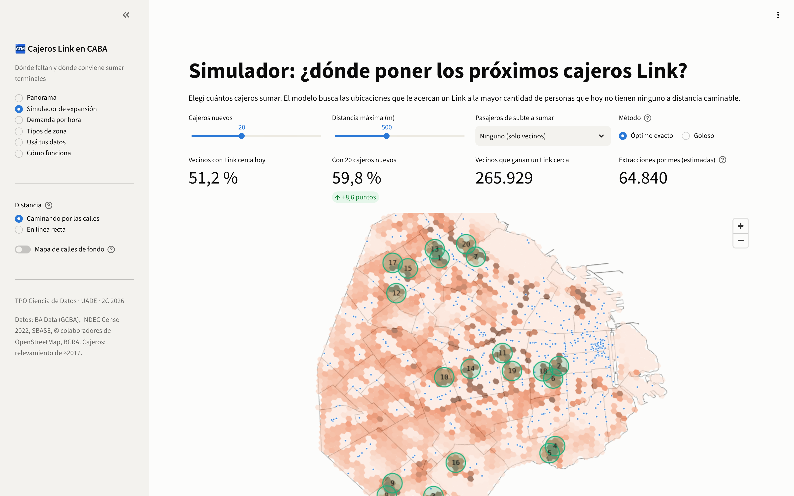
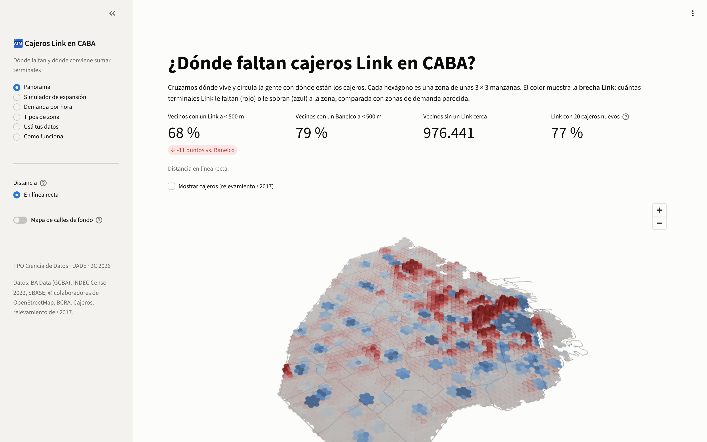
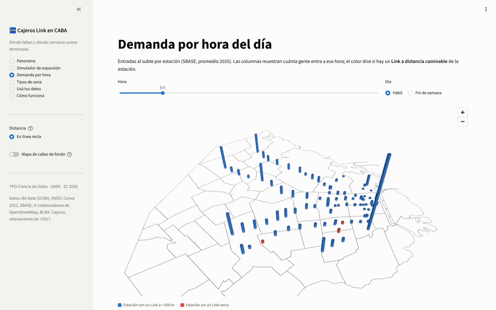
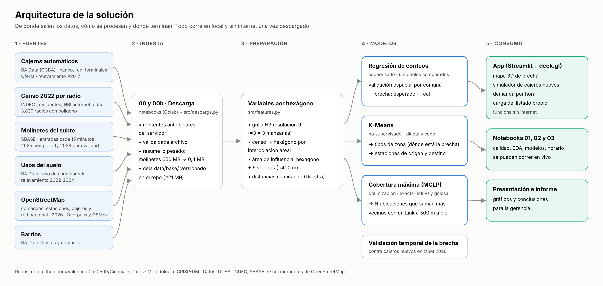

# ¿Dónde faltan cajeros Link en CABA?

**TPO de Ciencia de Datos · UADE · 2º cuatrimestre 2026**

Cruzamos dónde vive y circula la gente con dónde están los cajeros automáticos para responder una pregunta de negocio:
**¿en qué zonas de la Ciudad le conviene a Red Link sumar terminales?**

## Resultados en una mirada

| | |
|---|---|
| Vecinos con un **Link** a menos de 500 m (caminando) | **51 %** |
| Vecinos con un **Banelco** a menos de 500 m | **64 %** |
| Link con la misma regla, medida en línea recta | 68 % (la línea recta sobreestima la cobertura) |
| Vecinos sin un Link a distancia caminable | **1.507.883** |
| Con **20 cajeros** en las ubicaciones óptimas | Link pasa al **59,8 %** (+265.929 vecinos) |
| Cajeros nuevos para igualar la cobertura de Banelco | **35** |
| Modelo elegido (validación espacial) | Regresión de Poisson (GLM), D² = 0,62 |

Los cajeros **siguen al comercio, no a los vecinos**. Hay dos oportunidades: **competir** en los corredores comerciales del
norte y el centro, donde la demanda justifica más terminales Link de las que hay, y **cubrir** los barrios residenciales
(Belgrano, Villa Urquiza, Almagro) y el sur (Villa Lugano, Barracas, Villa Soldati), donde no hay un Link a distancia caminable. El detalle está en el [informe técnico](docs/informe.md).

## Cómo ver la app

### Opción 1 · En tu computadora (la que hay que usar en la defensa: funciona sin internet)

**1. Instalar Python (una sola vez).** Hace falta Python 3.10 o superior; recomendamos **3.12**. En Windows, lo más simple es
abrir una terminal y escribir:

```bat
winget install -e --id Python.Python.3.12
```

También se puede bajar de [python.org](https://www.python.org/downloads/windows/): en el instalador hay que marcar
**"Add python.exe to PATH"**. Después de instalarlo, cerrar la terminal y abrir una nueva.

**2. Bajar el repositorio.** Con [Git](https://git-scm.com/downloads):
`git clone https://github.com/ValentinoDiaz0509/CienciaDeDatos.git`, o desde GitHub con *Code → Download ZIP*.

**3. Abrir la app.**
- **Windows:** doble clic en **`abrir_app.bat`**.
- **macOS / Linux:** en una terminal, dentro de la carpeta, `./abrir_app.sh`.

La primera vez crea el entorno e instala lo necesario (tarda unos minutos); las siguientes abre en segundos. La app queda en
`http://localhost:8501` y el navegador se abre solo. Para cerrarla, cerrar la ventana de la terminal.

<details>
<summary>Paso a paso a mano (si el archivo no funciona)</summary>

En Windows (cmd), dentro de la carpeta del repositorio:

```bat
py -3.12 -m venv .venv
.venv\Scripts\activate
pip install -r app\requirements.txt
streamlit run app\app.py
```

En macOS / Linux:

```bash
python3 -m venv .venv
source .venv/bin/activate
pip install -r app/requirements.txt
streamlit run app/app.py
```

Después, abrir `http://localhost:8501` en el navegador. Para correr también los notebooks, instalar el archivo completo:
`pip install -r requirements.txt`.
</details>

### Opción 2 · Publicada en internet (para compartirla con el grupo o el profe)

1. Entrá a [share.streamlit.io](https://share.streamlit.io) con tu cuenta de GitHub.
2. *Create app* → elegí el repositorio `ValentinoDiaz0509/CienciaDeDatos`, la rama `main` y el archivo `app/app.py`.
3. *Deploy*. En unos minutos queda una dirección pública para abrir desde cualquier navegador.

La app tiene seis secciones: panorama (mapa 3D de la brecha), simulador de cajeros nuevos, demanda por hora, tipos de zona,
"usá tus datos" (cargar el listado actual de cajeros) y cómo funciona.



| Panorama | Demanda por hora |
|---|---|
|  |  |

## Entregables de la consigna

| # | Entregable | Dónde está |
|---|---|---|
| 1 | Dominio y problema | [informe §1](docs/informe.md#1-comprensión-del-negocio) |
| 2 | Arquitectura de la solución | [diagrama](docs/figuras/arquitectura.png) e [informe §3](docs/informe.md#3-preparación-de-los-datos) |
| 3 | Análisis exploratorio | [`notebooks/01_calidad_y_eda.ipynb`](notebooks/01_calidad_y_eda.ipynb) |
| 4 | Técnica de minería y por qué | [`notebooks/02_modelos.ipynb`](notebooks/02_modelos.ipynb) y [`03_demanda_por_hora.ipynb`](notebooks/03_demanda_por_hora.ipynb) |
| 5 | Conclusión con visualización | [informe](docs/informe.md#resumen-ejecutivo), notebook 02 §8 y la presentación |
| 6 | Aplicación funcional | [`app/app.py`](app/app.py) |

La [guía de defensa](docs/defensa.md) repasa la consigna punto por punto e incluye roles, guion de 15 minutos, checklist y
preguntas probables.

## Metodología (CRISP-DM)



1. **Datos:** seis fuentes públicas: BA Data (GCBA), Censo 2022 (INDEC), molinetes del subte (SBASE) y OpenStreetMap.
   Calidad medida con las seis dimensiones de DAMA.
2. **Preparación:** grilla de 2.793 hexágonos H3 (≈3 × 3 manzanas), interpolación areal del censo y áreas de
   influencia de ≈400 m. Distancias caminando por la red peatonal de OpenStreetMap (Dijkstra).
3. **Modelos:**
   - regresión de conteos con validación cruzada espacial (seis modelos y un ensamble), para medir la brecha;
   - K-Means, para los tipos de zona y de estación de subte;
   - cobertura máxima resuelta de forma exacta (programación lineal entera con HiGHS) y con un algoritmo goloso.
4. **Evaluación:** validación temporal con los cajeros que aparecieron en OpenStreetMap después de 2017.
5. **Despliegue:** app de Streamlit con mapas de deck.gl, que funciona sin conexión.

## Estructura del repositorio

```text
├── app/app.py                      # la app (streamlit run app/app.py)
├── data/
│   ├── base/                       # fuentes livianas, versionadas (ver LEEME.md)
│   ├── processed/                  # resultados del pipeline (los usa la app)
│   └── raw/                        # descargas completas (no se suben)
├── docs/
│   ├── informe.md                  # informe técnico (CRISP-DM)
│   ├── defensa.md                  # guía para la presentación
│   └── figuras/                    # gráficos y diagrama de arquitectura
├── notebooks/
│   ├── 00_descarga_datos.ipynb     # baja todas las fuentes (Colab)
│   ├── 00b_red_peatonal.ipynb      # baja la red de calles (Colab)
│   ├── 01_calidad_y_eda.ipynb      # calidad de datos y análisis exploratorio
│   ├── 02_modelos.ipynb            # regresión, clustering, optimización, validación
│   └── 03_demanda_por_hora.ipynb   # perfiles horarios del subte
├── src/
│   ├── descarga.py  features.py  modelos.py  red.py  horario.py  pipeline.py  estilo.py
└── requirements.txt
```

## Reproducir todo desde cero

```bash
pip install -r requirements.txt
python -m src.pipeline                      # variables, modelos y resultados (≈1 minuto)
for f in notebooks/_construir/nb0*.py; do python "$f"; done   # regenera los notebooks (textos con los números nuevos)
python docs/_construir/informe.py && python docs/_construir/readme.py
```

Para volver a bajar las fuentes: [00 · Descarga](https://colab.research.google.com/github/ValentinoDiaz0509/CienciaDeDatos/blob/main/notebooks/00_descarga_datos.ipynb) y [00b · Red peatonal](https://colab.research.google.com/github/ValentinoDiaz0509/CienciaDeDatos/blob/main/notebooks/00b_red_peatonal.ipynb)
en Colab (*Entorno de ejecución → Ejecutar todo*).

## Fuentes y licencias

- Cajeros automáticos, barrios, usos del suelo y molinetes: [BA Data](https://data.buenosaires.gob.ar), Gobierno de la Ciudad de Buenos Aires.
- Censo Nacional 2022 por radio censal: INDEC, vía [censoargentino](https://github.com/pedroorden/censoargentino).
- Comercios, estaciones y red peatonal: © colaboradores de [OpenStreetMap](https://www.openstreetmap.org/copyright) (ODbL).
- Extracciones por terminal: BCRA, *Informe Mensual de Pagos Minoristas*, agosto 2025.

**Aviso:** el listado público de cajeros corresponde a un relevamiento de alrededor de 2017. Solo se usan datos públicos;
ningún dato interno de Red Link.
