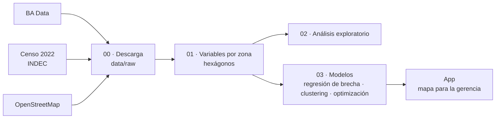

# ¿Dónde faltan cajeros Link en CABA?

TPO de Ciencia de Datos · UADE · 2º cuatrimestre 2026

## El problema

**Hipótesis.** En CABA hay zonas con mucha demanda potencial y pocos cajeros Link. Si las detectamos con datos públicos, la Gerencia Comercial y Técnica de Red Link puede proponerles a sus bancos dónde instalar las próximas terminales con un argumento medible, en vez de a ojo.

| | |
|---|---|
| **Para quién** | Gerencia Comercial y Técnica de Red Link |
| **Qué decide** | A qué bancos de la red proponerles instalar terminales, y dónde |
| **Cómo entrega valor** | Recupera operaciones que hoy se van a otra red o no se hacen, y lo dice en un número: "con N cajeros nuevos, X mil personas pasan a tener un Link a menos de 500 m" |

**Supuestos (los decimos en la defensa):**
- Cada banco compra e instala sus cajeros; Red Link opera la red y procesa las operaciones.
- No usamos datos internos de Red Link. Las transacciones son privadas, así que la demanda se estima con datos públicos: población, flujo de pasajeros, comercios y oficinas.
- Por eso "brecha" significa *esta zona tiene menos cajeros que otras zonas parecidas*, no "acá hay X extracciones perdidas".

## Fuentes de datos

| Fuente | Qué aporta | Origen |
|---|---|---|
| Cajeros automáticos | Oferta actual: ubicación, banco, red y cantidad de terminales | [BA Data](https://data.buenosaires.gob.ar/dataset/cajeros-automaticos) |
| Censo 2022 por radio censal | Población, edad, actividad, NBI, acceso a internet | INDEC, vía [`censoargentino`](https://github.com/pedroorden/censoargentino) |
| Subte: viajes por molinete 2025-2026 | Cuánta gente pasa por cada estación y a qué hora | [BA Data / SBASE](https://data.buenosaires.gob.ar/dataset/subte-viajes-molinetes) |
| Relevamiento de usos del suelo 2022-2024 | Uso de cada parcela: comercio, oficinas, residencial | [BA Data](https://data.buenosaires.gob.ar/dataset/relevamiento-usos-suelo) |
| Barrios | Límites y nombres | [BA Data](https://data.buenosaires.gob.ar/dataset/barrios) |
| OpenStreetMap | Estaciones de subte y tren, sucursales bancarias, cajeros de todas las redes, comercios | [Overpass API](https://overpass-api.de), © colaboradores de OpenStreetMap |

> **Ojo con los cajeros:** el listado de BA Data parece ser un relevamiento de alrededor de 2017 (detalle en [`data/base/LEEME.md`](data/base/LEEME.md)).

## Arquitectura



## Cómo correrlo

Los datos livianos ya están en `data/base/`, así que para analizar alcanza con clonar el repo.

**1. Bajar los datos de nuevo (solo si hace falta actualizarlos).** Abrí el notebook en Colab y ejecutá todo (*Entorno de ejecución → Ejecutar todo*). Tarda entre 5 y 15 minutos y al final descarga `datos_tpo.zip`.

[](https://colab.research.google.com/github/ValentinoDiaz0509/CienciaDeDatos/blob/main/notebooks/00_descarga_datos.ipynb)

O en local, parado en la raíz del repo:

```bash
pip install -r requirements.txt
python -m src.descarga
```

BA Data a veces devuelve errores de servidor. El script reintenta cada archivo, sigue con el resto si alguno falla y al final muestra qué bajó y qué no. Se puede volver a correr: lo que ya está descargado no se baja de nuevo.

## Estructura

```text
├── data/
│   ├── base/                     # versiones livianas, listas para analizar (sí se suben; ver LEEME.md)
│   └── raw/                      # descargas originales completas (no se suben)
├── notebooks/
│   └── 00_descarga_datos.ipynb   # baja todas las fuentes y arma datos_tpo.zip
├── src/
│   └── descarga.py               # lógica de descarga y resumen de archivos pesados
└── requirements.txt
```

## Entregables de la consigna

- [x] Dominio y problema
- [ ] Arquitectura de la solución (borrador arriba)
- [ ] Análisis exploratorio
- [ ] Técnica de minería y modelo
- [ ] Conclusión con visualización y storytelling
- [ ] Aplicación funcional
